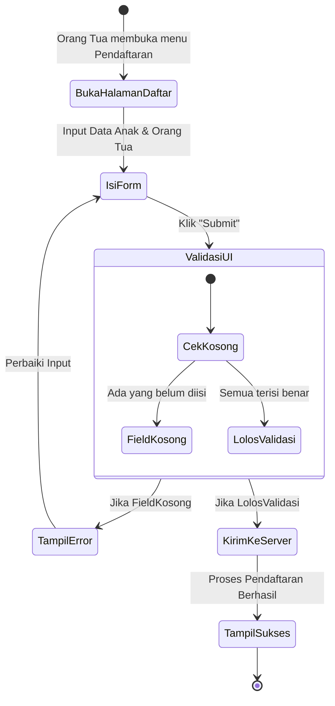
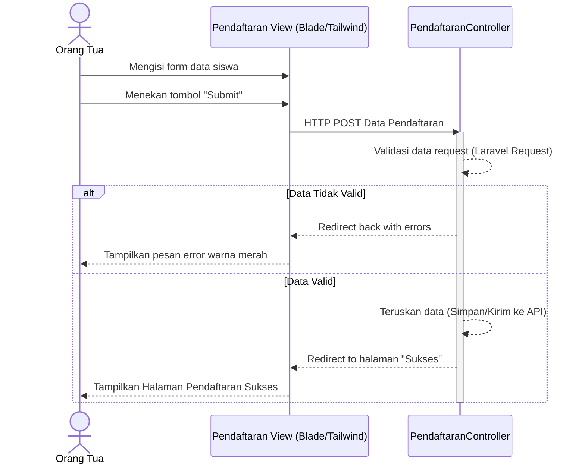
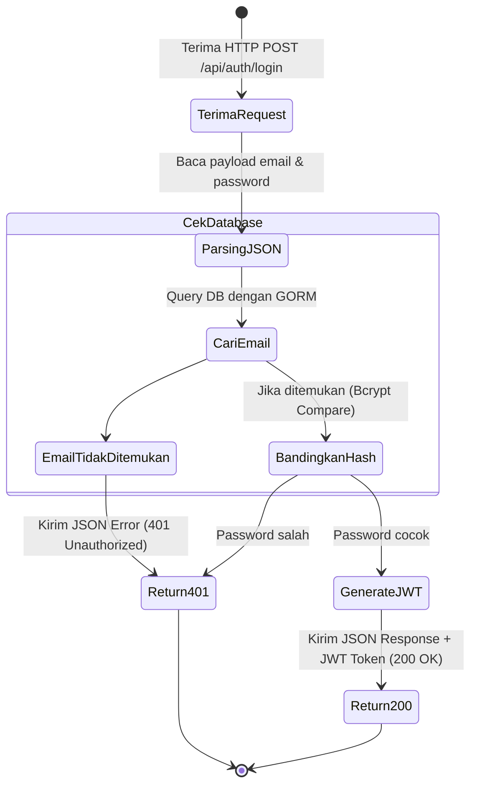
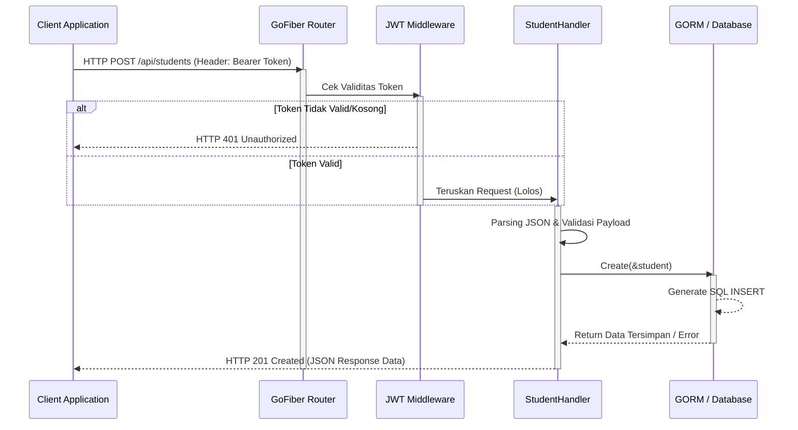

# UML Diagram - Pendaftaran Online TK Aqila

Dokumen ini berisi pemodelan sistem menggunakan *Unified Modeling Language* (UML) yang dipisah berdasarkan fokus topik skripsi, yaitu **Front End (Faris)** dan **Back End (Rahwul)**. Anda dapat meletakkan diagram ini pada Bab IV masing-masing dokumen.

---

## 1. FRONT END (FARIS) - Fokus pada UI/UX & Interaksi Pengguna (Laravel)

### 1.1 Use Case Diagram (Front End)
Menggambarkan interaksi antara pengguna (*Orang Tua* dan *Admin*) dengan fitur-fitur antarmuka yang ada di aplikasi web.

```mermaid
usecaseDiagram
    actor "Orang Tua / Wali Murid" as ortu
    actor "Admin TK Aqila" as admin

    package "Sistem Front End Pendaftaran (Laravel)" {
        usecase "Registrasi Akun" as UC1
        usecase "Login ke Sistem" as UC2
        usecase "Mengisi Form Pendaftaran" as UC3
        usecase "Melihat Status Pendaftaran" as UC4
        usecase "Melihat Daftar Peserta" as UC5
        usecase "Memverifikasi (Setuju/Tolak)" as UC6
        usecase "Melihat Laporan" as UC7
    }

    ortu --> UC1
    ortu --> UC2
    ortu --> UC3
    ortu --> UC4

    admin --> UC2
    admin --> UC5
    admin --> UC6
    admin --> UC7
```

### 1.2 Activity Diagram (Front End - Alur Pendaftaran)
Menggambarkan alur aktivitas saat Orang Tua mengisi form pendaftaran di halaman web.



### 1.3 Sequence Diagram (Front End - Proses Submit Form)
Menggambarkan urutan interaksi dari antarmuka (*View*) menuju *Controller* Laravel hingga mengembalikan tampilan sukses.



---

## 2. BACK END (RAHWUL) - Fokus pada REST API, Logika, & Database (Golang/GoFiber)

### 2.1 Use Case Diagram (Back End / REST API)
Karena fokus pada API, aktor utamanya adalah *Client Application* (Front End) yang melakukan *request* ke *endpoint-endpoint* GoFiber.

```mermaid
usecaseDiagram
    actor "Client App (Front End)" as client

    package "Sistem Back End API (Golang & MySQL)" {
        usecase "POST /auth/register (Registrasi)" as API1
        usecase "POST /auth/login (Generate JWT)" as API2
        usecase "GET /me (Ambil Profil)" as API3
        usecase "POST /students (Simpan Data Anak)" as API4
        usecase "GET /students (List Pendaftar)" as API5
        usecase "PUT /students/status (Update Status)" as API6
    }

    client --> API1
    client --> API2
    client --> API3
    client --> API4
    client --> API5
    client --> API6
```

### 2.2 Activity Diagram (Back End - Proses API Login & Autentikasi)
Menggambarkan alur di sisi *server* saat menerima *request* login dan menghasilkan *JSON Web Token* (JWT).



### 2.3 Sequence Diagram (Back End - Proses Simpan Data Pendaftaran)
Menggambarkan alur eksekusi saat sistem *Back End* (GoFiber) memproses penyimpanan data ke *MySQL database* menggunakan *GORM*.


